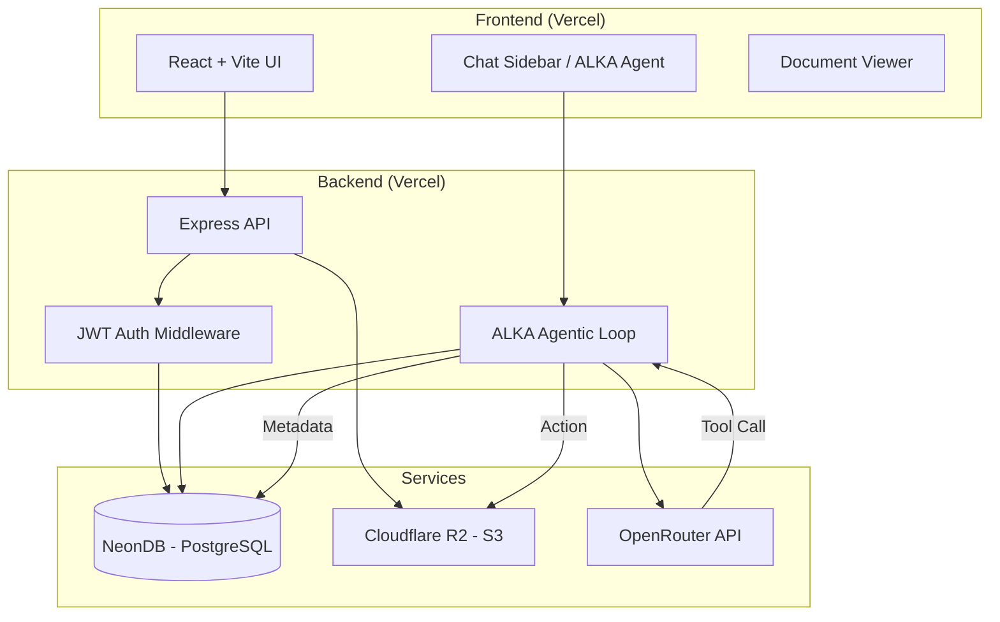

# Helper.io

**Helper.io** is a premium AI-powered document management and learning platform. It allows users to upload personal notes, manage documentation, and interact with ALKA that can summarize content, generate quizzes, and even autonomously manage your files.

---

## ✨ Features

- **📄 Document Management**: Upload, view, and organize `.md` and `.txt` files securely.
- **🤖 ALKA Agent**: A context-aware AI assistant powered by OpenRouter (Gemini/Llama).
- **🛠️ Agentic Capabilities**: The AI isn't just a chatbot—it can create, update, and delete documents for you via tool calling.
- **🧠 Intelligent Learning**: Generate instant summaries and interactive quizzes from your study materials.
- **📌 Sticky Notes**: Add digital annotations directly onto your documentation.
- **📊 Architecture-Ready**: Built with a scalable monorepo structure.

---

## 🛠️ Tech Stack

### Frontend
- **Framework**: [React 19](https://react.dev/) + [Vite](https://vitejs.dev/)
- **Styling**: [Tailwind CSS](https://tailwindcss.com/)
- **Icons**: [Lucide React](https://lucide.dev/)
- **Markdown**: [React-Markdown](https://github.com/remarkjs/react-markdown) with GFM and Syntax Highlighting.
- **Diagrams**: [Mermaid.js](https://mermaid.js.org/) for rendering logic diagrams.

### Backend
- **Runtime**: [Node.js](https://nodejs.org/)
- **Framework**: [Express.js](https://expressjs.com/)
- **Database**: [NeonDB](https://neon.tech/) (Serverless PostgreSQL)
- **Object Storage**: [Cloudflare R2](https://www.cloudflare.com/products/r2/) (S3-compatible)
- **Authentication**: JWT (JSON Web Tokens) & Bcrypt hashing.

### AI Engine
- **Provider**: [OpenRouter](https://openrouter.ai/)
- **Models**: Nvidia, Llama 3 (Agentic mode)
- **Logic**: Custom Agentic Loop with function calling for document manipulation.

---

## 📐 System Architecture

The following diagram represents the end-to-end flow of the application:



---

## 🚀 Getting Started

### Prerequisites
- Node.js (v18+)
- A NeonDB connection string
- Cloudflare R2 Credentials (Access Key, Secret Key, Bucket Name)
- OpenRouter API Key

### Installation

1. **Clone the repo**
   ```bash
   git clone https://github.com/Dipalikar/Helper.io.git
   cd Helper.io
   ```

2. **Setup Server**
   ```bash
   cd server
   npm install
   # Create a .env file with:
   # DATABASE_URL, OPENROUTER_API_KEY, R2_ACCESS_KEY, R2_SECRET_KEY, R2_BUCKET_NAME
   ```

3. **Setup Client**
   ```bash
   cd ../client
   npm install
   # Create a .env file with:
   # VITE_API_BASE_URL=http://localhost:5000
   npm run dev
   ```

---

**Built with ❤️ by Dipali Kar**